```python
import pandas as pd
from pandas import Series, DataFrame
```


```python
titanic_df = pd.read_csv('train.csv')
titanic_df.head()
```


<div>
<table border="1" class="dataframe">
  <thead>
    <tr style="text-align: right;">
      <th></th>
      <th>PassengerId</th>
      <th>Survived</th>
      <th>Pclass</th>
      <th>Name</th>
      <th>Sex</th>
      <th>Age</th>
      <th>SibSp</th>
      <th>Parch</th>
      <th>Ticket</th>
      <th>Fare</th>
      <th>Cabin</th>
      <th>Embarked</th>
    </tr>
  </thead>
  <tbody>
    <tr>
      <th>0</th>
      <td>1</td>
      <td>0</td>
      <td>3</td>
      <td>Braund, Mr. Owen Harris</td>
      <td>male</td>
      <td>22</td>
      <td>1</td>
      <td>0</td>
      <td>A/5 21171</td>
      <td>7.2500</td>
      <td>NaN</td>
      <td>S</td>
    </tr>
    <tr>
      <th>1</th>
      <td>2</td>
      <td>1</td>
      <td>1</td>
      <td>Cumings, Mrs. John Bradley (Florence Briggs Th...</td>
      <td>female</td>
      <td>38</td>
      <td>1</td>
      <td>0</td>
      <td>PC 17599</td>
      <td>71.2833</td>
      <td>C85</td>
      <td>C</td>
    </tr>
    <tr>
      <th>2</th>
      <td>3</td>
      <td>1</td>
      <td>3</td>
      <td>Heikkinen, Miss. Laina</td>
      <td>female</td>
      <td>26</td>
      <td>0</td>
      <td>0</td>
      <td>STON/O2. 3101282</td>
      <td>7.9250</td>
      <td>NaN</td>
      <td>S</td>
    </tr>
    <tr>
      <th>3</th>
      <td>4</td>
      <td>1</td>
      <td>1</td>
      <td>Futrelle, Mrs. Jacques Heath (Lily May Peel)</td>
      <td>female</td>
      <td>35</td>
      <td>1</td>
      <td>0</td>
      <td>113803</td>
      <td>53.1000</td>
      <td>C123</td>
      <td>S</td>
    </tr>
    <tr>
      <th>4</th>
      <td>5</td>
      <td>0</td>
      <td>3</td>
      <td>Allen, Mr. William Henry</td>
      <td>male</td>
      <td>35</td>
      <td>0</td>
      <td>0</td>
      <td>373450</td>
      <td>8.0500</td>
      <td>NaN</td>
      <td>S</td>
    </tr>
  </tbody>
</table>
</div>


```python
"""VARIABLE DESCRIPTIONS: from https://www.kaggle.com/c/titanic/data?train.csv
survival        Survival
                (0 = No; 1 = Yes)
pclass          Passenger Class
                (1 = 1st; 2 = 2nd; 3 = 3rd)
name            Name
sex             Sex
age             Age
sibsp           Number of Siblings/Spouses Aboard
parch           Number of Parents/Children Aboard
ticket          Ticket Number
fare            Passenger Fare
cabin           Cabin
embarked        Port of Embarkation
                (C = Cherbourg; Q = Queenstown; S = Southampton)
"""
```


    'VARIABLE DESCRIPTIONS:\nsurvival        Survival\n                (0 = No; 1 = Yes)\npclass          Passenger Class\n                (1 = 1st; 2 = 2nd; 3 = 3rd)\nname            Name\nsex             Sex\nage             Age\nsibsp           Number of Siblings/Spouses Aboard\nparch           Number of Parents/Children Aboard\nticket          Ticket Number\nfare            Passenger Fare\ncabin           Cabin\nembarked        Port of Embarkation\n                (C = Cherbourg; Q = Queenstown; S = Southampton)\n'


```python
titanic_df.info()
```

    <class 'pandas.core.frame.DataFrame'>
    Int64Index: 891 entries, 0 to 890
    Data columns (total 12 columns):
    PassengerId    891 non-null int64
    Survived       891 non-null int64
    Pclass         891 non-null int64
    Name           891 non-null object
    Sex            891 non-null object
    Age            714 non-null float64
    SibSp          891 non-null int64
    Parch          891 non-null int64
    Ticket         891 non-null object
    Fare           891 non-null float64
    Cabin          204 non-null object
    Embarked       889 non-null object
    dtypes: float64(2), int64(5), object(5)
    memory usage: 90.5+ KB
    


```python
#Question 1: WHo were the passengers on the Titanic? (Ages, Gender, Class, ...)
```


```python
import numpy as np
import matplotlib.pyplot as plt
import seaborn as sns
%matplotlib inline
```


```python
sns.factorplot('Sex', data=titanic_df, kind='count') #checks gender
```


    <seaborn.axisgrid.FacetGrid at 0x2765585d908>


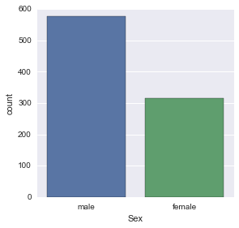


```python
#separate gender by classes
sns.factorplot('Sex', data=titanic_df, hue='Pclass', kind='count')
```


    <seaborn.axisgrid.FacetGrid at 0x27655fea2b0>


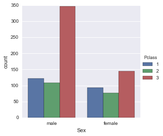


```python
sns.factorplot('Pclass', data=titanic_df, hue='Sex', kind='count')
```


    <seaborn.axisgrid.FacetGrid at 0x27656013208>


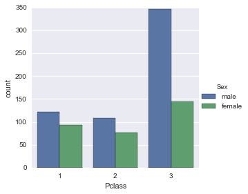


```python
def male_female_child(passenger):
    age,sex = passenger
    if age<16:
        return 'child'
    else:
        return sex
```


```python
titanic_df['person'] = titanic_df[['Age','Sex']].apply(male_female_child, axis=1)
```


```python
titanic_df.head(10)
```


<div>
<table border="1" class="dataframe">
  <thead>
    <tr style="text-align: right;">
      <th></th>
      <th>PassengerId</th>
      <th>Survived</th>
      <th>Pclass</th>
      <th>Name</th>
      <th>Sex</th>
      <th>Age</th>
      <th>SibSp</th>
      <th>Parch</th>
      <th>Ticket</th>
      <th>Fare</th>
      <th>Cabin</th>
      <th>Embarked</th>
      <th>Alone</th>
      <th>Survivor</th>
      <th>person</th>
    </tr>
  </thead>
  <tbody>
    <tr>
      <th>0</th>
      <td>1</td>
      <td>0</td>
      <td>3</td>
      <td>Braund, Mr. Owen Harris</td>
      <td>male</td>
      <td>22</td>
      <td>1</td>
      <td>0</td>
      <td>A/5 21171</td>
      <td>7.2500</td>
      <td>NaN</td>
      <td>S</td>
      <td>With Family</td>
      <td>no</td>
      <td>male</td>
    </tr>
    <tr>
      <th>1</th>
      <td>2</td>
      <td>1</td>
      <td>1</td>
      <td>Cumings, Mrs. John Bradley (Florence Briggs Th...</td>
      <td>female</td>
      <td>38</td>
      <td>1</td>
      <td>0</td>
      <td>PC 17599</td>
      <td>71.2833</td>
      <td>C85</td>
      <td>C</td>
      <td>With Family</td>
      <td>yes</td>
      <td>female</td>
    </tr>
    <tr>
      <th>2</th>
      <td>3</td>
      <td>1</td>
      <td>3</td>
      <td>Heikkinen, Miss. Laina</td>
      <td>female</td>
      <td>26</td>
      <td>0</td>
      <td>0</td>
      <td>STON/O2. 3101282</td>
      <td>7.9250</td>
      <td>NaN</td>
      <td>S</td>
      <td>Alone</td>
      <td>yes</td>
      <td>female</td>
    </tr>
    <tr>
      <th>3</th>
      <td>4</td>
      <td>1</td>
      <td>1</td>
      <td>Futrelle, Mrs. Jacques Heath (Lily May Peel)</td>
      <td>female</td>
      <td>35</td>
      <td>1</td>
      <td>0</td>
      <td>113803</td>
      <td>53.1000</td>
      <td>C123</td>
      <td>S</td>
      <td>With Family</td>
      <td>yes</td>
      <td>female</td>
    </tr>
    <tr>
      <th>4</th>
      <td>5</td>
      <td>0</td>
      <td>3</td>
      <td>Allen, Mr. William Henry</td>
      <td>male</td>
      <td>35</td>
      <td>0</td>
      <td>0</td>
      <td>373450</td>
      <td>8.0500</td>
      <td>NaN</td>
      <td>S</td>
      <td>Alone</td>
      <td>no</td>
      <td>male</td>
    </tr>
    <tr>
      <th>5</th>
      <td>6</td>
      <td>0</td>
      <td>3</td>
      <td>Moran, Mr. James</td>
      <td>male</td>
      <td>NaN</td>
      <td>0</td>
      <td>0</td>
      <td>330877</td>
      <td>8.4583</td>
      <td>NaN</td>
      <td>Q</td>
      <td>Alone</td>
      <td>no</td>
      <td>male</td>
    </tr>
    <tr>
      <th>6</th>
      <td>7</td>
      <td>0</td>
      <td>1</td>
      <td>McCarthy, Mr. Timothy J</td>
      <td>male</td>
      <td>54</td>
      <td>0</td>
      <td>0</td>
      <td>17463</td>
      <td>51.8625</td>
      <td>E46</td>
      <td>S</td>
      <td>Alone</td>
      <td>no</td>
      <td>male</td>
    </tr>
    <tr>
      <th>7</th>
      <td>8</td>
      <td>0</td>
      <td>3</td>
      <td>Palsson, Master. Gosta Leonard</td>
      <td>male</td>
      <td>2</td>
      <td>3</td>
      <td>1</td>
      <td>349909</td>
      <td>21.0750</td>
      <td>NaN</td>
      <td>S</td>
      <td>With Family</td>
      <td>no</td>
      <td>child</td>
    </tr>
    <tr>
      <th>8</th>
      <td>9</td>
      <td>1</td>
      <td>3</td>
      <td>Johnson, Mrs. Oscar W (Elisabeth Vilhelmina Berg)</td>
      <td>female</td>
      <td>27</td>
      <td>0</td>
      <td>2</td>
      <td>347742</td>
      <td>11.1333</td>
      <td>NaN</td>
      <td>S</td>
      <td>With Family</td>
      <td>yes</td>
      <td>female</td>
    </tr>
    <tr>
      <th>9</th>
      <td>10</td>
      <td>1</td>
      <td>2</td>
      <td>Nasser, Mrs. Nicholas (Adele Achem)</td>
      <td>female</td>
      <td>14</td>
      <td>1</td>
      <td>0</td>
      <td>237736</td>
      <td>30.0708</td>
      <td>NaN</td>
      <td>C</td>
      <td>With Family</td>
      <td>yes</td>
      <td>child</td>
    </tr>
  </tbody>
</table>
</div>


```python
sns.factorplot('Pclass', data=titanic_df, hue='person', kind='count')
```


    <seaborn.axisgrid.FacetGrid at 0x27657872898>


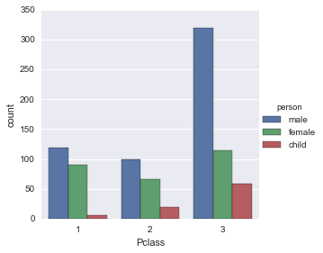


```python
titanic_df['Age'].hist(bins=70)
```


    <matplotlib.axes._subplots.AxesSubplot at 0x27657902cc0>


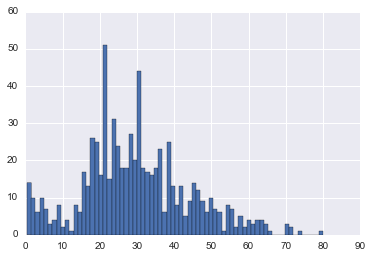


```python
titanic_df['Age'].mean() #mean age
```


    29.69911764705882


```python
titanic_df['person'].value_counts()
```


    male      537
    female    271
    child      83
    Name: person, dtype: int64


```python
fig = sns.FacetGrid(titanic_df, hue='Sex', aspect=4)

fig.map(sns.kdeplot, 'Age', shade=True)

oldest = titanic_df['Age'].max()

fig.set(xlim=(0,oldest))

fig.add_legend()
```


    <seaborn.axisgrid.FacetGrid at 0x27658a04eb8>


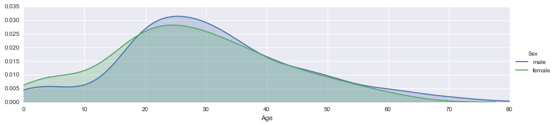


```python
fig = sns.FacetGrid(titanic_df, hue='person', aspect=4)

fig.map(sns.kdeplot, 'Age', shade=True)

oldest = titanic_df['Age'].max()

fig.set(xlim=(0,oldest))

fig.add_legend()
```


    <seaborn.axisgrid.FacetGrid at 0x27658a4f828>


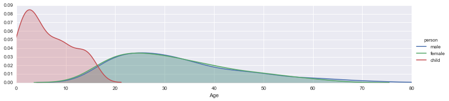


```python
fig = sns.FacetGrid(titanic_df, hue='Pclass', aspect=4)

fig.map(sns.kdeplot, 'Age', shade=True)

oldest = titanic_df['Age'].max()

fig.set(xlim=(0,oldest))

fig.add_legend()
```


    <seaborn.axisgrid.FacetGrid at 0x27658b340f0>


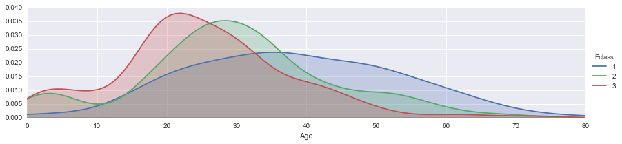


```python
#Question 2: What deck were the passengers on and how does that relate to their class?
```


```python
#Quick look at a preview of the data
titanic_df.head()
```


<div>
<table border="1" class="dataframe">
  <thead>
    <tr style="text-align: right;">
      <th></th>
      <th>PassengerId</th>
      <th>Survived</th>
      <th>Pclass</th>
      <th>Name</th>
      <th>Sex</th>
      <th>Age</th>
      <th>SibSp</th>
      <th>Parch</th>
      <th>Ticket</th>
      <th>Fare</th>
      <th>Cabin</th>
      <th>Embarked</th>
      <th>Alone</th>
      <th>Survivor</th>
      <th>person</th>
    </tr>
  </thead>
  <tbody>
    <tr>
      <th>0</th>
      <td>1</td>
      <td>0</td>
      <td>3</td>
      <td>Braund, Mr. Owen Harris</td>
      <td>male</td>
      <td>22</td>
      <td>1</td>
      <td>0</td>
      <td>A/5 21171</td>
      <td>7.2500</td>
      <td>NaN</td>
      <td>S</td>
      <td>With Family</td>
      <td>no</td>
      <td>male</td>
    </tr>
    <tr>
      <th>1</th>
      <td>2</td>
      <td>1</td>
      <td>1</td>
      <td>Cumings, Mrs. John Bradley (Florence Briggs Th...</td>
      <td>female</td>
      <td>38</td>
      <td>1</td>
      <td>0</td>
      <td>PC 17599</td>
      <td>71.2833</td>
      <td>C85</td>
      <td>C</td>
      <td>With Family</td>
      <td>yes</td>
      <td>female</td>
    </tr>
    <tr>
      <th>2</th>
      <td>3</td>
      <td>1</td>
      <td>3</td>
      <td>Heikkinen, Miss. Laina</td>
      <td>female</td>
      <td>26</td>
      <td>0</td>
      <td>0</td>
      <td>STON/O2. 3101282</td>
      <td>7.9250</td>
      <td>NaN</td>
      <td>S</td>
      <td>Alone</td>
      <td>yes</td>
      <td>female</td>
    </tr>
    <tr>
      <th>3</th>
      <td>4</td>
      <td>1</td>
      <td>1</td>
      <td>Futrelle, Mrs. Jacques Heath (Lily May Peel)</td>
      <td>female</td>
      <td>35</td>
      <td>1</td>
      <td>0</td>
      <td>113803</td>
      <td>53.1000</td>
      <td>C123</td>
      <td>S</td>
      <td>With Family</td>
      <td>yes</td>
      <td>female</td>
    </tr>
    <tr>
      <th>4</th>
      <td>5</td>
      <td>0</td>
      <td>3</td>
      <td>Allen, Mr. William Henry</td>
      <td>male</td>
      <td>35</td>
      <td>0</td>
      <td>0</td>
      <td>373450</td>
      <td>8.0500</td>
      <td>NaN</td>
      <td>S</td>
      <td>Alone</td>
      <td>no</td>
      <td>male</td>
    </tr>
  </tbody>
</table>
</div>


```python
#The cabin column has information on the deck, but it has several NaN values that
#need to be dropped
```


```python
deck = titanic_df['Cabin'].dropna()
deck.head()
```


    1      C85
    3     C123
    6      E46
    10      G6
    11    C103
    Name: Cabin, dtype: object


```python
#We only need the first letter of the deck to classify its level (e.g. A,B,...,G)
#We can grab the first letter for the deck level using a for-loop
levels = []
for level in deck:
    levels.append(level[0])
    
levelSet = set(levels) #get unique levels
levelList = list(levelSet) #list of unique level values
levelList.sort() #sort levels in alphabetical order

#Reset DataFrame and use factor plot
cabin_df = DataFrame(levels)

cabin_df.columns = ['Cabin']

sns.factorplot('Cabin', data=cabin_df, order=levelList, palette = 'winter_d', kind='count')
```


    <seaborn.axisgrid.FacetGrid at 0x27658b78ef0>


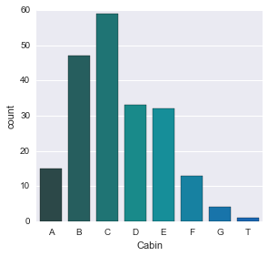


```python
cabin_df = cabin_df[cabin_df != 'T'] #There is no T cabin, se we remove it

sns.factorplot('Cabin', data=cabin_df, order=levelList, palette = 'summer', kind='count')
```


    <seaborn.axisgrid.FacetGrid at 0x27658a5b208>


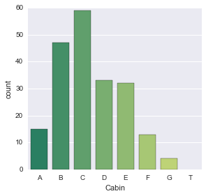


```python
titanic_df.head()
```


<div>
<table border="1" class="dataframe">
  <thead>
    <tr style="text-align: right;">
      <th></th>
      <th>PassengerId</th>
      <th>Survived</th>
      <th>Pclass</th>
      <th>Name</th>
      <th>Sex</th>
      <th>Age</th>
      <th>SibSp</th>
      <th>Parch</th>
      <th>Ticket</th>
      <th>Fare</th>
      <th>Cabin</th>
      <th>Embarked</th>
      <th>Alone</th>
      <th>Survivor</th>
      <th>person</th>
    </tr>
  </thead>
  <tbody>
    <tr>
      <th>0</th>
      <td>1</td>
      <td>0</td>
      <td>3</td>
      <td>Braund, Mr. Owen Harris</td>
      <td>male</td>
      <td>22</td>
      <td>1</td>
      <td>0</td>
      <td>A/5 21171</td>
      <td>7.2500</td>
      <td>NaN</td>
      <td>S</td>
      <td>With Family</td>
      <td>no</td>
      <td>male</td>
    </tr>
    <tr>
      <th>1</th>
      <td>2</td>
      <td>1</td>
      <td>1</td>
      <td>Cumings, Mrs. John Bradley (Florence Briggs Th...</td>
      <td>female</td>
      <td>38</td>
      <td>1</td>
      <td>0</td>
      <td>PC 17599</td>
      <td>71.2833</td>
      <td>C85</td>
      <td>C</td>
      <td>With Family</td>
      <td>yes</td>
      <td>female</td>
    </tr>
    <tr>
      <th>2</th>
      <td>3</td>
      <td>1</td>
      <td>3</td>
      <td>Heikkinen, Miss. Laina</td>
      <td>female</td>
      <td>26</td>
      <td>0</td>
      <td>0</td>
      <td>STON/O2. 3101282</td>
      <td>7.9250</td>
      <td>NaN</td>
      <td>S</td>
      <td>Alone</td>
      <td>yes</td>
      <td>female</td>
    </tr>
    <tr>
      <th>3</th>
      <td>4</td>
      <td>1</td>
      <td>1</td>
      <td>Futrelle, Mrs. Jacques Heath (Lily May Peel)</td>
      <td>female</td>
      <td>35</td>
      <td>1</td>
      <td>0</td>
      <td>113803</td>
      <td>53.1000</td>
      <td>C123</td>
      <td>S</td>
      <td>With Family</td>
      <td>yes</td>
      <td>female</td>
    </tr>
    <tr>
      <th>4</th>
      <td>5</td>
      <td>0</td>
      <td>3</td>
      <td>Allen, Mr. William Henry</td>
      <td>male</td>
      <td>35</td>
      <td>0</td>
      <td>0</td>
      <td>373450</td>
      <td>8.0500</td>
      <td>NaN</td>
      <td>S</td>
      <td>Alone</td>
      <td>no</td>
      <td>male</td>
    </tr>
  </tbody>
</table>
</div>


```python
#Question 3: Where did the passengers come from?
```


```python
sns.factorplot('Embarked', data=titanic_df, hue='Pclass', kind = 'count', order=['C','Q','S'])
```


    <seaborn.axisgrid.FacetGrid at 0x27658bfc518>


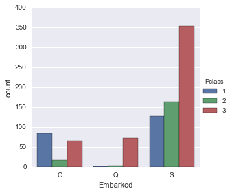


```python
#Question 4: Who was alone and who was with Family?
```


```python
#sibsp           Number of Siblings/Spouses Aboard
#parch           Number of Parents/Children Aboard
titanic_df['Alone'] = titanic_df.SibSp + titanic_df.Parch 
#THe 'Alone column >0 if the passenger had family onboard
```


```python
titanic_df['Alone'].loc[titanic_df['Alone']>0] = 'With Family'
titanic_df['Alone'].loc[titanic_df['Alone']==0] = 'Alone'
```

    C:\Users\MopeAkande\Anaconda3\envs\py35\lib\site-packages\pandas\core\indexing.py:117: SettingWithCopyWarning: 
    A value is trying to be set on a copy of a slice from a DataFrame
    
    See the caveats in the documentation: http://pandas.pydata.org/pandas-docs/stable/indexing.html#indexing-view-versus-copy
      self._setitem_with_indexer(indexer, value)
    


```python
titanic_df.head() #A preview to see the Alone column
```


<div>
<table border="1" class="dataframe">
  <thead>
    <tr style="text-align: right;">
      <th></th>
      <th>PassengerId</th>
      <th>Survived</th>
      <th>Pclass</th>
      <th>Name</th>
      <th>Sex</th>
      <th>Age</th>
      <th>SibSp</th>
      <th>Parch</th>
      <th>Ticket</th>
      <th>Fare</th>
      <th>Cabin</th>
      <th>Embarked</th>
      <th>Alone</th>
      <th>Survivor</th>
      <th>person</th>
    </tr>
  </thead>
  <tbody>
    <tr>
      <th>0</th>
      <td>1</td>
      <td>0</td>
      <td>3</td>
      <td>Braund, Mr. Owen Harris</td>
      <td>male</td>
      <td>22</td>
      <td>1</td>
      <td>0</td>
      <td>A/5 21171</td>
      <td>7.2500</td>
      <td>NaN</td>
      <td>S</td>
      <td>With Family</td>
      <td>no</td>
      <td>male</td>
    </tr>
    <tr>
      <th>1</th>
      <td>2</td>
      <td>1</td>
      <td>1</td>
      <td>Cumings, Mrs. John Bradley (Florence Briggs Th...</td>
      <td>female</td>
      <td>38</td>
      <td>1</td>
      <td>0</td>
      <td>PC 17599</td>
      <td>71.2833</td>
      <td>C85</td>
      <td>C</td>
      <td>With Family</td>
      <td>yes</td>
      <td>female</td>
    </tr>
    <tr>
      <th>2</th>
      <td>3</td>
      <td>1</td>
      <td>3</td>
      <td>Heikkinen, Miss. Laina</td>
      <td>female</td>
      <td>26</td>
      <td>0</td>
      <td>0</td>
      <td>STON/O2. 3101282</td>
      <td>7.9250</td>
      <td>NaN</td>
      <td>S</td>
      <td>Alone</td>
      <td>yes</td>
      <td>female</td>
    </tr>
    <tr>
      <th>3</th>
      <td>4</td>
      <td>1</td>
      <td>1</td>
      <td>Futrelle, Mrs. Jacques Heath (Lily May Peel)</td>
      <td>female</td>
      <td>35</td>
      <td>1</td>
      <td>0</td>
      <td>113803</td>
      <td>53.1000</td>
      <td>C123</td>
      <td>S</td>
      <td>With Family</td>
      <td>yes</td>
      <td>female</td>
    </tr>
    <tr>
      <th>4</th>
      <td>5</td>
      <td>0</td>
      <td>3</td>
      <td>Allen, Mr. William Henry</td>
      <td>male</td>
      <td>35</td>
      <td>0</td>
      <td>0</td>
      <td>373450</td>
      <td>8.0500</td>
      <td>NaN</td>
      <td>S</td>
      <td>Alone</td>
      <td>no</td>
      <td>male</td>
    </tr>
  </tbody>
</table>
</div>


```python
sns.factorplot('Alone', data=titanic_df, palette='Blues', kind='count')
```


    <seaborn.axisgrid.FacetGrid at 0x27655826438>


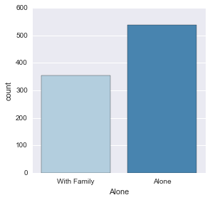


```python
#Question 5: What factors helped a person survive
```


```python
#We can create a new column for easy reading through mapping
titanic_df['Survivor'] = titanic_df.Survived.map({0:'no', 1:'yes'})
sns.factorplot('Survivor', data=titanic_df, palette='Set1', kind='count')
```


    <seaborn.axisgrid.FacetGrid at 0x27657794898>


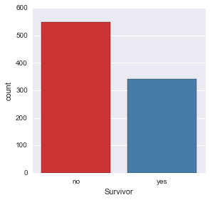


```python
# 5-a Was class a factor in Survival?
sns.factorplot('Pclass','Survived',data=titanic_df)
```


    <seaborn.axisgrid.FacetGrid at 0x276577919e8>


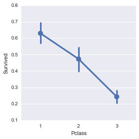


```python
#The survival rate for 3rd class seems much lower.
#Is this because of the "women and children first" policy?
#Let's use another factor plot that considers class and gender
sns.factorplot('Pclass','Survived', hue='person', data=titanic_df)
```


    <seaborn.axisgrid.FacetGrid at 0x27658d7a630>


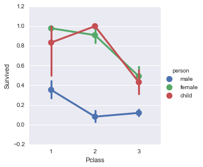


```python
#Looks like being a male andbeing in 3rd class made survival unlikely
#Being a male definitely made survival unlikely
```


```python
#5-b Did age have any effect on survival rate?
```


```python
sns.lmplot('Age', 'Survived', data=titanic_df) #plots data and linear regression model fit
```


    <seaborn.axisgrid.FacetGrid at 0x27658df15c0>


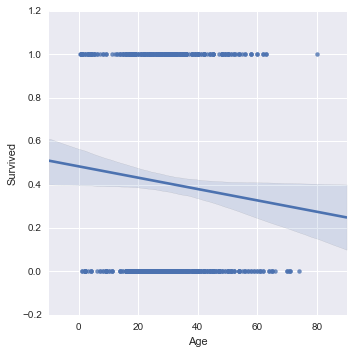


```python
# appears that older people were less likely to survive
```


```python
sns.lmplot('Age','Survived', hue='Pclass',data=titanic_df, palette='autumn')
```


    <seaborn.axisgrid.FacetGrid at 0x27659f8cac8>


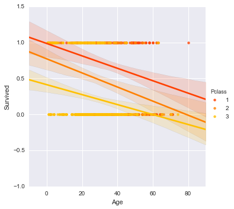


```python
#To clean up this figure by binning using age with a standard deviation attached
generations = [10,20,40,60,80]
sns.lmplot('Age','Survived',hue='Pclass',data=titanic_df,palette='autumn',x_bins=generations)
```


    <seaborn.axisgrid.FacetGrid at 0x2765a0727f0>


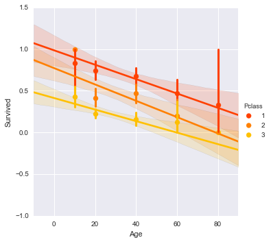


```python
#There is a high standard deviation on the older people in firstclass
```


```python
#5-c What if we relate gender and age with the survival set?
sns.lmplot('Age','Survived',hue='Sex',data=titanic_df,palette='autumn',x_bins=generations)
```


    <seaborn.axisgrid.FacetGrid at 0x2765a0eb668>


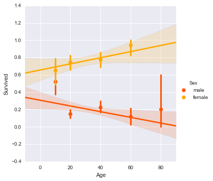


```python
#looks like older females had a better chance of survival
```
